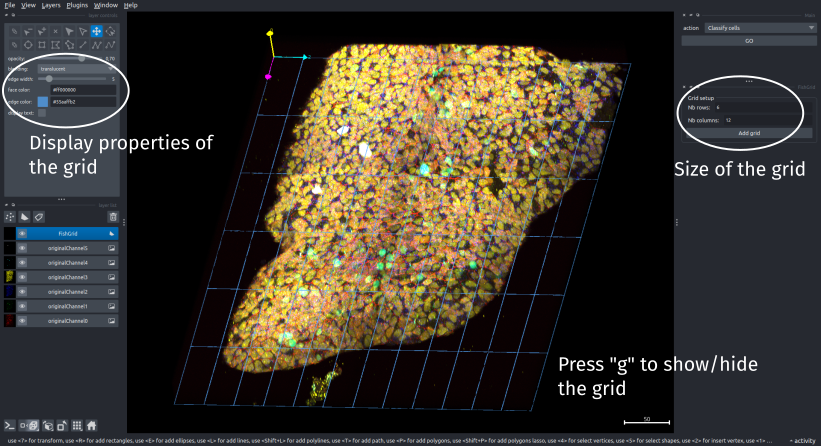

!!! abstract "Add a grid to the viewer"
	_To add/show/hide a grid on the viewer, press <kbd>g</kbd>. Or select `Misc:Add grid` in the main pipeline interface_

## Grid set-up
When creating the grid, if you press <kbd>g</kbd> or select the `Add grid` option, the parameters to setup the grid will appear in the right panel of the viewer.

You can specify the number of lines and columns. 
By default, the name of each cell of the grid is displayed in the center of the cell.
You can disable this by unselecting `display text` in the top left panel of the `FisherGrid` layer (which should be selected).
In this panel, you can also modify the width of the grid lines and its color.

## Grid display
Once the grid has been created, you can always switch between showing it or hiding it by pressing <kbd>g</kbd>. 
