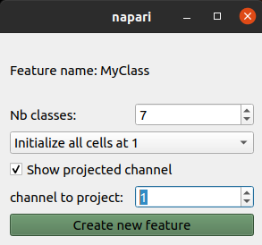
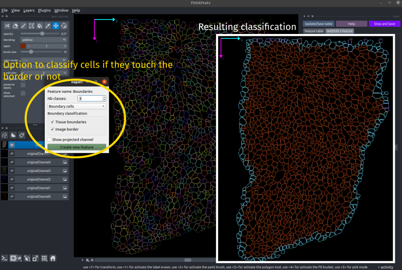

!!! abstract "Classify cells with a user defined criteria"
	_Select `Classify cells` in the main pipeline step_ (1) 
	{ .annotate }

	1. You can also launch it out of the pipeline in `Plugins>FishFeats>Classify segmented cells`

!!! warning "Cells must have been created/saved before to use this step" 
	The file named _imagename_`_cells2D.tif` should have been saved, or the `get cells` step should have been performed in the main pipeline before.

When you start this step, you get an interface with a table containing all the cells and all the features (classifications) already done. 
You can click on one cell to see it in the image.

In the second onglet of the interface, you can add a new feature/classification to do, either by writing a new feature name to create a new one, or by selecting an already present one in the list to edit it.
Choose a feature name that will be reelvant for you (_eg. "PCNA", "DoubleNucleus", "SuperCell"..._). 
The program will add "Feat\_" in front of the name of the feature to indicate that it is a feature.

Click on `Do feature` to open the interface to choose how you want to [initialize your classification](#classification-prefilling).

## Classification prefilling

When you click on `Do feature`, it will either [reload the feature](#Load-classification) if it was already present or open a parameter interface to choose how to initialize the feature.

In the first line, the interface shows the feature name that you have entered.

You can choose the number of possible classes for this feature (`Nb classes` parameter)(1). For example, if the feature can only be positive (=2) or negative (=1), the number of classes will be 2.
{.annotate}

1.  _Note that you can also change it later by clicking `Add one class` in the edit interface_. 

Then you can select the method to use to prefill the classification automatically (you will be able to manually edit it afterwards). 

You can either have a prefilled classification with all the cells in the same class ([`Initialize all cells at 1`](#empty-prefilling)), based on a thresholding of one chanel ([`from projection+threshold`](#from-intensity-projection)), based on the position of cells on edges or not ([`Boundary cells`](#boundary-cells). 

Click on `Create new feature` to launch the classification of your new feature. It will add a new layer, called `Feat_`_featurename_`Cells`, prefilled according to the selected method. In that layer, one color corresponds to one class so if `nb classes` is 7, you can have 7 colors.

You now have the possibility to [manually edit the classification](#manual-editing), with the `Feat_` _featurename_ parameter interface and to see the table of cells with their corresponding classification with the `Features table` interface. 
Click on `Update/save table` button to update the displayed table in the `Feature table` onglet and save it in the `results.csv` file.
If you do another feature later (running again the `Edit/Add feature` interface), it will be added to this table so you can accumulate the analysis.

### Empty prefilling 

The classification can be prefilled automatically if your classification is binary ("yes" or "no") and depends on the intensity in one chanel of the image. 

### From intensity projection
Choose the method `from projection+threshold` and the corresponding chanel `proj chanel`. It will make a 2D projection of this chanel, and classify as "yes" (2) cells that have at least `threshold_areaprop`% of its pixel brighter than: `mean(intensity) * threshold_frommean`.

You can then see the table with the automatically calculated feature and manually edit the automated classfication by using specific shortcuts.

### Boundary classification

With this option, you can choose to automatically classify the cells according to if they touch the border of the image (and thus might not be complete), or are on the edge of the tissue (no neihbors in one side), or next to a big hole in the tissue.
By selecting `Boundary cells`, you can choose if you want to classify the cells that touch the border of the image `Image border` and/or on the edges (of tissue or holes) `Tissue boundary`. 
The cells will be classified as 1 if they are not a border or a boundarie, 2 if they are a boundary cell and 3 if they are a border cell.

### Load classification

If you select a feature name from the proposed list on the feature name parameter and click on `Do feature`, it will automatically load the previous classification (that is saved and loaded from the file _imagename_`_results.csv`.
You can directly edit it.

## Manual editing

To modify the classification of some cells, you can set the current value to assign with the `Class value` parameter. This parameter can take value from 1 to the `nb classes` parameter that you chose previously in the `Do feature` interface (the number of classes). 
You can increase the maximum number of classes to add a new one by clicking the button `add one class` in the right-side interface.

You can change the current value of this `Class value` parameter by sliding the bar in the interface, or by **pressing <kbd>i</kbd> to increase its value or <kbd>d</kbd> to decrease it**.

Also, if you right-click on a cell, you can set it to the cell's class.
It will automatically set-up the `Class value` parameter to the classification of the selected cell. 

To change the class of a cell and set it to the current value of `Class value` parameter, press <kbd>Control+left click</kbd> on the cell. 
It's color will be udpate directly after the click.

When you click on `Update/save table`, the current classification will be saved (in the filename`_results.csv` file along with the other results) and the displayed table in the `Feature table` onglet will be updated. 
The current step is not stopped, so don't hesitate to save regularly.

You can then click on `Feature` _featurename_ `done` to close the interface of this feature and do another feature or finish this step. It will remove the feature layer, but the results of the classification will still be present in the features table.

If you want to export the view of the classified cells, click on `export feature image`. It will save it in a file called _imagename_`_feat_`_featurename_`.png` in the `results` folder.  

## Features table

All the results of the classified features are summarized in the `Feature table`. Each row is one segmented cell and each column the features that have been defined. 
The table will be saved in the results folder in the results file called _imagename_`_results.csv` . 
If the plugin is closed and open again on the same image, the features will be automatically reloaded. You can edit them by loading the corresponding feature. 

If you click on `Stop and Save`, this feature table will be closed, and all opened feature layers and interfaces will be closed.
