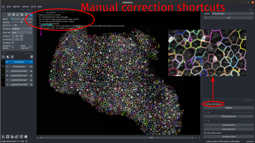
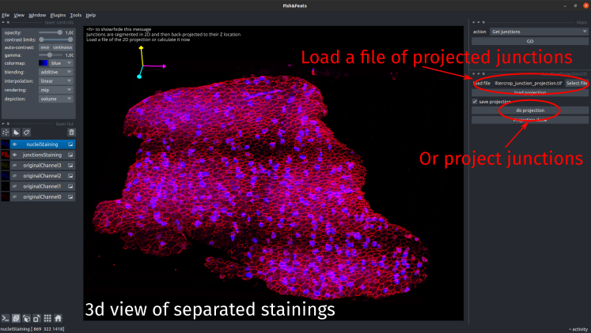
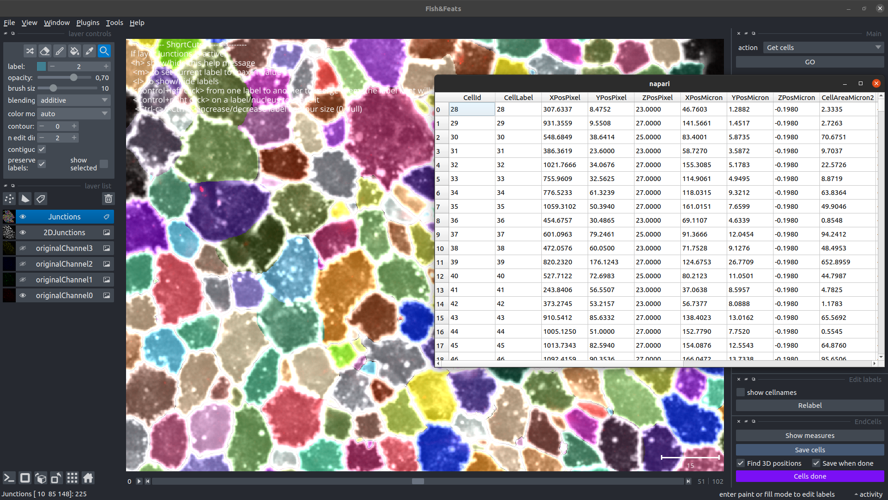

**This step allows to segment the junction staining to detect the cells apical area.**

_Choose `Get cells` in the main interface to run it._

Nb: in previous version of FishFeats, this step is called `Get junctions` in the interface

# Segmentation process

**1/ 3D->2D:** The segmentation of the cellular junctions is performed in **2D**. First the junction staining will be [projected in a 2D](#2d-projection) plane by taking a local average of the slices around the maximum intensity signal. If the nuclei staining is in the same channel, the signals will be separated first. In that case, when you click on `Get junctions` the interface to [separate junctions and nuclei](./Separate-junctions-and-nuclei) will appear and you must execute it before to be able to do the segmentation. A layer called `2DJunctions` will appears when the projection will be finished/loaded.

**2/ 2D segmentation:** The plugin proposes several options to perform the segmentation from the 2D images of junctions:

* [Epyseg](https://github.com/baigouy/EPySeg): tool for epithelial segmentation from Aigouy et al. 2020.
* [Epyseg-Dask](#epyseg-dask): uses Dask to parallelize the segmentation with Epyseg (faster on large image).
* [CellPose](https://www.cellpose.org/): tool for cellular segmentation from Stringer et al. 2021.
* Load an already segmented file (should be a file of labelled cell). If you choose this option, the plugin will look for the labelled file of cell, named _imagename_`_cells2D.tif` in the results folder, but you can select another file.

**3/ Manual correction:** When the computation of the segmentation is finished, `fishfeats` will show you the results in a `label` layer called `Junctions`. You can then perform manual correction if needed before to save the results.

**4/ 2D->3D:** At the end of the process, when you click on `Junctions done`, the pipeline creates the cells from the segmentation. The shape will be the label shape and the [cell position in Z](./3d-cell-positions) will be back-projected into the junction staining. Thus this step can take a few minutes to calculate the back-projection. 

## 2d projection

The junction staining will be segmented in 2D. If you have already calculated the projection previously or with another pipeline, you can load here the image of the projection and directly use it. Else, the pipeline will calculate the projection by looking at local maximum intensities. Click on `do projection` to launch the calculation or load the selected file.

The pipeline will by default save the calculated projection in the `results` folder, except if you don't check the `save projection` option. When this step is done, you can now performs the segmentation of this projected image.

# Manual correction

The result of the segmentation is saved and displayed as labelled apical cells: each cell is assigned a unique number (the label) that is put in all the pixels inside the cell surface. The colors reflect the values (labels) of each cell. 0 indicates background pixels (no cell). In `fishfeats` the label `1` is reserved to indicate unassigned elements, so should not be used to label cells.

To correct eventual segmentation errors, on the left top panel, you have the napari tools to edit labels and on the right panel additional `fishfeats` editing options.

## Visualization:

* The labels (cells) can be displayed as filled areas (put `contour` to 0) or only the contour lines can be shown with the `contour` option.
* To see only the current label (the pixels which have the value that is currently active in the `label` field), check the `show selected` box on the left panel.
* To see all the labels value around the cell position, you can select the `show_cellnames` option on the right panel. To remove them, uncheck it. _Shortcut: press <kbd>l</kbd> to show/hide cell labels_
* Click on the eye icon next to the junction channel layer to show/hide it.
* Press <kbd>5</kbd> to switch to zoom/moving mode.
* Press <kbd>v</kbd> to show/hide the current layer (here the `Junctions` layer).
* Press <kbd>Ctrl-c</kbd> (or <kbd>Ctrl-c</kbd>) to increase (or decrease) the labels contour width (`contour:` parameter in Napari top left interface). If the value is set to `0` then the labels will be filled. 

## Label editing:

* Press <kbd>2</kbd> to switch to drawing mode or click on the pencil icon. You can draw a label with this pencil tool. When it is selected, it will draw with the current value in the field below. You can choose the precision of your drawing with the `brush stroke` parameter.
 
* _Press <kbd>3</kbd> to switch to fill mode_.
To replace a whole label by a new value (label), you can use the `fill` option. Put the desired value in the label field and click on the label to fill with it. 

* To select a label, you can put the value in the `label` field or you can use the picker tool and click on the corresponding area. _Press <kbd>4</kbd> to switch to picker mode_. _Or right click on the area to get it directly_.

* To delete a label, put `0` as the current value (_or press <kbd>1</kbd>_), select the `fill` tool and click on the label to remove. _Or left double-click on a label to erase it directly_.

* To reorder the labels, click on `relabel update`, and the cells will be relabeled with consecutive values from 2 to the number of cells.

* To draw a new cell, you have to select a value that is **not used yet**. The simpler is to use the maximal current value and add one to be sure to use a new value. You can get this value by pressing <kbd>m</kbd>. It will directly put the max value + 1 in the active label field and active the drawing mode.

* The `preserve labels` option allows you to freeze other labels than the current active one. If you try to draw on top of another label, it will not work as the other labels have been locked. This is convenient when you draw a new label to be sure to draw the new cell just against the other ones without modifying them. If you try to draw on a label when this option is activated, you will get an error message appearing.

* To merge two neighboring cells (labels) into one, press <kbd>Control</kbd> and left-click from one cell to another. You should keep the mouse button clicked when dragging from one to another.

## Save corrected results

To save the manual corrections, click on `save junctions`. It will save a file called _imagename_`_cells2D.tif` in the `results` folder that contained the labelled cells.

## Measures

You can display a table of measurements of the cells position, area and label. Click on the button `Show measures` to perform the measurement. A new window containing the table of all the cells and their area will appear.

This table will be automatically saved when the cell segmentation is saved, in the _imagename_`_results.csv` output file and will be completed during the pipeline by other measurements (cytoplasmic measures, nuclei measure, RNA counts...)

## Junctions analysis finished

When you have finished the segmentation and manual correction steps, click on `Junctions done` to quit this step and go back to the main step choices.

If `save when done` is checked, the segmentation will be saved as a `.tif` file that can reloaded later, as well as the table of the cell coordinates and area in the _imagename_`_results.csv` output file.
