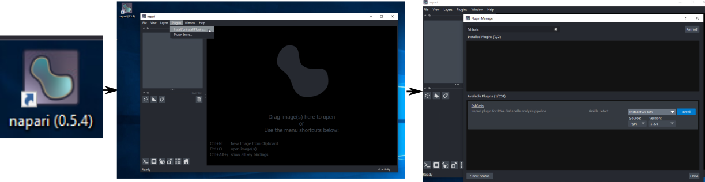

# Installation

FishFeats is distributed in a pip module and can be installed as:
```
pip install fishfeats
```
in a virtual environment (python 3.10 recommended).

If you are not familiar with the procedure, here are two options for installation with more details:

[**Standard installation**](#standard-installation): You can install napari and `FishFeats` by creating/using a python virtual environment (**recommended**).

[**Easier installation**](#easier-installation): If you have no python virtual environment experience and want to avoid it, you can install napari through the "bundle" distribution. 
The bundles come with an installer program for Windows and MacOS systemso this allow for an easy installation (everything will be done through graphical interfaces), but allows for less control/flexibility. 

The table below summarizes the installation options that you have and their compatibility (in **November 2025**). 
For more details for each step, goes to the corresponding paragraph: [**Standard installation**](#standard-installation) for a python management package based installation, and [**Easier installation**](#easier-installation) for the bundle app based installation.


## Standard installation
To install FishFeat you need to install napari first. 
Napari is Python based and you need to install Python management package if you don't have one already. 
You first need to install that (few minutes to 10min), then create a virtual environment and install napari and fishfeats (less than 5 min). 

### From napari interface
FishFeats is a napari plugin, in python. You can install it either through an already installed napari by going in napari to `Plugins>Install/Uninstall`, search for `FishFeats` and click `Install`.
You could have version issues between the different modules installed in your environment and FishFeats dependencies, in which case it is recommended to create a new virtual environment specific for FishFeats.

### From a virtual environment (recommended)

**Step 1 : install a Python management package (if you don't have one already).** 
You have different options, but you have to choose one:  

- Miniforge (**recommended**): fast, free but no interface. Follow the detailled steps here to [install miniforge](https://kirenz.github.io/codelabs/codelabs/miniforge-setup/#0)
- venv: fast and simple install in general, no interface. See [tutorial here](https://www.geeksforgeeks.org/create-virtual-environment-using-venv-python/)
- Mamba: fast, free but no interface. See [here](https://informatics.fas.harvard.edu/resources/tutorials/installing-command-line-software-conda-mamba/)
- Anaconda: a sort of interface, works well on MacOS and Windows but slow and might not stay free to all. See here: [on windows](https://www.geeksforgeeks.org/how-to-install-anaconda-on-windows/), [on macOS](https://www.geeksforgeeks.org/installation-guide/how-to-install-anaconda-on-macos/?ref=ml_lbp) or [on linux](https://www.geeksforgeeks.org/how-to-install-anaconda-on-linux/) ). 
 
**Step 2 : Create a virtual environment with that python management package.** 
Once you have installed such Python management package, they generally create one environment (=call env) called base but you should not install anything in that env.  

- You need to create an environment where you will install FishFeats and napari. To do so you first open the terminal, then you can write `conda env list` to list all your environments. 
If you don’t already have one env for fishfeats you can create one by : ```conda create -n fishfeats_env python=3.10``` 
It will install python 3.10 and create an environment called `fishfeats_env`. 

- Then you need to activate that environment (=like entering or opening it) by writing : ```conda activate fishfeats_env``` 

- Then you can install napari and FishFeats and all the depencies they need : `pip install fishfeats`. 
It takes a bit of time, be patient. Congrats and see you in Step 3 then. 

**Step 3: Open napari**
You can open napari by writing `napari` in the terminal. 
It is often slow to open the first time but that’s it. 
 

**Extra information:** 

- you can create more environment, they are rather light in size. Be careful because with Python, and napari of course, plugin and librairies are often dependent on many other to properly works and very often, installing a new one can create major issues in the environment that was previously working.... 

- to logout, you can just close the terminal. To come back to FishFeats, you can open the terminal, enter `conda activate fishfeats_env`, `napari` 

!!! warning "Installation of dependencies"
	FishFeats depends on a lot of external librairies, some of which are under active development and others that are no longer maintained. We tried to put few constraints on the librairy versions to allow for flexibility in the installation, but also to identify which ones should be limited. Don't hesitate to look at our [Trouble shooting page](./Known-errors-and-solutions.md), where we listed some environment configurations that worked and could thus be reproduced.


#### Update FishFeats

To get the latest version of FishFeats when it is updated, type
``` 
pip install -U fishfeats
```
in your activated environment. 
If FishFeats was updated since you last installed/updated it, the latest version will be downloaded.

#### Start FishFeats

Open napari by typing
```
napari
```
in the activated environnement and goes to `Plugins>FishFeats>Start fishfeats`

## Compatibility/Dependencies

`FishFeats` depends on several Python modules to allow different tasks. It is not necessary to install all the dependencies to run it, only the ones listed in `setup.cfg` configuration file. When installing the plugin, the listed dependencies will be automatically installed. 

Other dependencies can be installed individually if the corresponding option will be used (e.g. install cellpose: `pip install cellpose`).
They can also be all installed by installing FishFeats in full mode `pip install `fishfeats[full]` `.

### Operating System
The plugin has been developped on a Linux environment and is used on Windows and MacOS distributions. It should thus be compatible with all these OS provided to have the adequate python environments.

??? warning "Windows GPU drivers"
	We encountered an unsolved yet error only on Windows with some specific nvidia drivers/GPU card. During plugin usage, it returns this error:`OSError: exception: access violation reading 0x0000000000000034`. See [here](Known-errors-and-solutions.md#acces-violation-reading) for more infos.


### Python version
We tested the plugin with python 3.9, 3.10, 3.11 with napari 0.4.19, 0.6.1. 
In [Trouble shooting](Known-errors-and-solutions.md), we listed some environments that worked for given operating system/Python version. 
You can also create your environment directly from these `.yaml` files.

There is an incompability with napari 0.4.17 (strongly not recommended) for point edition in 3D.

Please refers to [Trouble shooting](Known-errors-and-solutions.md) if you encounter issues at the installation/usage or to the repository issues. Finally if you don't find any information on your error, open a [new issue](https://github.com/gletort/FishFeats/issues) in this repository.

### Full working configuration

We listed examples of fully working configuration in `Windows`, `MacOS` and `Ubuntu` operating systems in the [Trouble shooting](Known-errors-and-solutions.md#tested-and-working-configurations) page.
You can compare the version of the dependencies to the ones in your environment in case of issue.

## Easier installation

### napari installation through a graphical interface
Download the bundle version of napari 0.5.4:

* [Linux version](https://github.com/napari/napari/releases/download/v0.5.4/napari-0.5.4-Linux-x86_64.sh)
* [Windows x86](https://github.com/napari/napari/releases/download/v0.5.4/napari-0.5.4-Windows-x86_64.exe)

* [MacOS arm64 (apple chip, from M1 and after)](https://github.com/napari/napari/releases/download/v0.5.4/napari-0.5.4-macOS-arm64.pkg) :fontawesome-solid-triangle-exclamation:
* [MacOS x86 (Intel chip, before M1)](https://github.com/napari/napari/releases/download/v0.5.4/napari-0.5.4-macOS-x86_64.pkg):fontawesome-solid-triangle-exclamation:

!!! warning "napari bundle doesn't open on MacOS" 
	On MacOS, the bundle version 0.5.4 might not work (after installation, it doesn't open, see more in [imagesc forum](https://forum.image.sc/t/bundle-napari-0-5-4-on-macos-permission-denied/117259)). In this case, proceed to the "normal" installation, or install the [latest napari bundle](https://napari.org/stable/tutorials/fundamentals/installation_bundle_conda.html#macos-bundle) (without epyseg then)). 

Double-click on the executable.
It will open an installer program, that you can simply follow step by step.
You can keep all the default options that are proposed by the installation program.
When the installation is finished (it takes some time), a shortcut icon should have been created in your desktop.


All these bundles come from napari github, [release of version 0.5.4](https://github.com/napari/napari/releases/tag/v0.5.4). 
The installation steps for each OS are described [here](https://napari.org/stable/tutorials/fundamentals/installation_bundle_conda.html).

??? note "Why napari version 0.5.4" 
	We chose this version as it is the last one in Python 3.9, the following ones are with Python > 3.11, to have all FishFeats options available (including Epyseg which is limited to version <3.11).
	You can still download the latest bundle of napari if you wish, and then use the napari console Terminal to fix dependencies install, or not use some options (Epyseg, and eventually Stardist and SepaNet which are based on Tensorflow).

### FishFeats installation through a graphical interface
When the installation is over, double-click on the napari icon and wait for napari window to open (it can take a few minutes). 
When napari is open, go to `Plugins>Install/Uninstall` to open the plugin manager.
In the window that appears, search for `fishfeats` and click Install.
Wait for the installation to finish (it takes some time), and restart napari.
You can now use FishFeats by going in `Plugins>fishfeats>start fishfeats`. 



If you want to install a specific version of FishFeats, click on `Installation info` to get the list of available versions.
**Restart napari after the plugin installation**.

??? tip "Updating some dependencies version"
	If you need to change some dependencies version, you can do so by opening the napari Terminal by clicking the icon :material-console-line: at the bottom left of the napari window. Then write `pip install modulename==versionnumber` to install the `modulename` library with the given version number.
