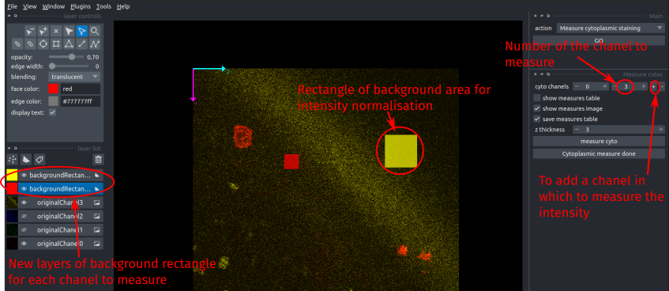
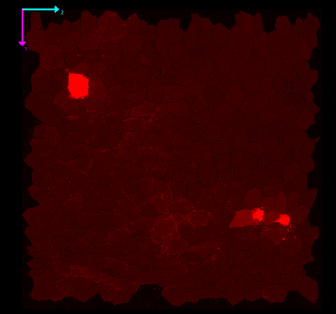

!!! abstract "Measure the intensity in one or more channels in the cytoplasm of cells"
	_To measure cytoplasmic intensity, choose the Measures:Cytoplasmic intensity in the main pipeline interface._

!!! example "See the typical workflow of this step [here](./FishFeatsFlowchartv5.pdf#page=5)"

This step allows you to measure the average intensity (normalised or not) in the cells (after segmentation) in a few Z slices close to the cell junctions. You can measure the intensity in several channels. By default, one is initally proposed: click on the <kbd>+</kbd> sign next to the `cyto chanels` parameter to increase the number of channels to measure (or <kbd>-</kbd> to remove one). Then, for each channel, set the number to the corresponding `originalChanel*` staining that you want to measure with the `cyto chanels` parameter(s). When you change the value of this parameter, the plugin shows you directly which chanel you are measuring. 

The parameter `z_thickness`controls the number of slices below the cell surface that will be used in the measurement. In the image below, the intensity will be averaged on 3 slices starting from each cell surface.

## Background rectangle

When you choose a chanel or add a new one, a layer `backgroundRectangle*` appears in the left panel. The number at the end of the name corresponds to the number of the channel to analyse. This rectangle will be used to normalise the intensity of this channel by dividing by its mean intensity, therefore you must place this rectangle in a background area of your staining, and in the typical Z-slice where you are going to measure the signal (should be there by default). You can move it or change its size. 

## Output

You can set the parameters to either pop-up the measurement table, add a new layer with the cells filled by the measured intensities or save the measurement table to an excel file. The image of the measurement intensities shows the normalised intensity measured in each cell, in the same color as the original chanel, ranging from dark for low values of normalised intensity to bright for high intensities. There will be one image for each measurement channel.

The measurement table gives you a list of all cells with their label and position. The last columns are the measured intensity in each measurement channel. For each channel, 4 values are given: the mean intensity, its standard deviation, the normalised mean intensity and its standard deviation. The columns are named `Cyto*_MeanIntensity`... where the number after `Cyto` is the number of the measured channel (staining).
