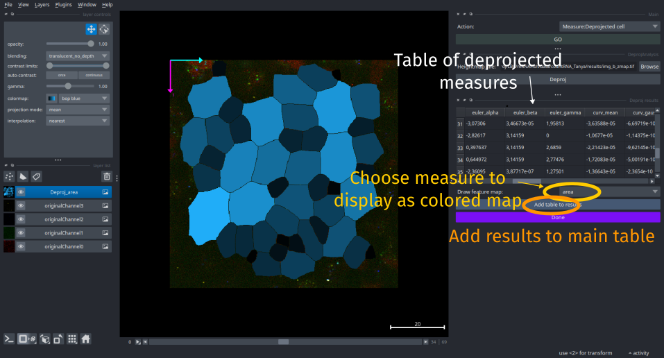

!!! abstract "Measure deprojected cell shape"
	_To measure cell properties with correction for the 2D projection artifacts, choose the Measures:Deprojected cells in the main pipeline interface._

This step allows you to measure morphological properties of cell, like their area, while correcting for their 3D->2D projection.

For bend tissue, projection from 3D to 2D and then measuring cell properties, as their area, on the 2D projection can generate small estimation error on the cell property (see [deproj webpage](https://github.com/Image-Analysis-Hub/DeProj/tree/master#measuring-cell-morphologies-on-2d-projections)).

If while doing the projection the mapping between the 3D and the 2D projection was saved, the height map, it is possible to get a better estimate of the cell 3D properties. 
[`Deproj`](https://github.com/Image-Analysis-Hub/DeProj/tree/master) is a matlab framework developed to estimate correct cell properties, see [Herbert et al. 2021](https://doi.org/10.1186/s12915-021-01037-w). 
[`Deprojpy`](https://github.com/zen-laboratory/DeProjPy) is a python implementation of this tool.
`FishFeats` relies on `deprojpy` to perform the deprojected calculation of cell properties.

For this, you have to precise the file that contains the z-map information (the real 3D position of each projected pixel). 
If you have done the projection with [`LocalZProjector`](https://github.com/Image-Analysis-Hub/LocalZProjector) or a similar tool, you can check options to also obtain this file along the projection results.
If not, you can go to the step [`Cells:3D position`](./3d-cell-positions.md) in `FishFeats` and check the option `Save Zmap`. 
[`LocalZBackProj`](https://github.com/Image-Analysis-Hub/localZBackProjector) can also be used to estimate and build the z-map from the projection and the original 3D image.

Select the file that contains the z-map and click on `Deproj` to estimate the correct cell properties.
A table with the measures will be displayed in the right side of the interface when the computation is done.
See [`Deprojpy`](https://github.com/zen-laboratory/DeProjPy) documentation for the description of the measures.

You can display the value of the deproj measure in each cell by selecting the corresponding feature in the `Draw feature map` option list.

To add these informations to the main `FishFeats`table results that is saved in the `results.csv` file and reloaded everytime, press the button `Add to results` before to close this step.
The added measures that comes from deprojected measurement are added with `Deproj_` prefix to the name of the measure (e.g. `Deproj_area`).
Hence, the measure of cell area ideally should be from the `Deproj_area` column that contains the corrected measure, while `Area` column would contains the purely 2D measure. 
