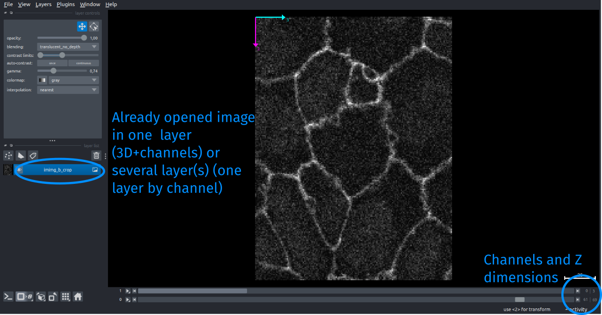
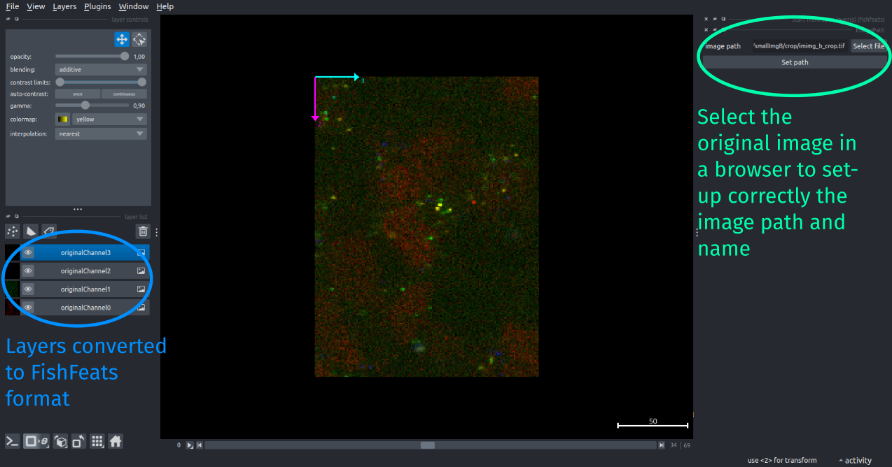

!!! abstract "Open the raw image to analyse" 

## Load raw images from FishFeats
FishFeats can directly load raw images with format `.tif, .ims or .czi` and read their metadata.

If your raw images have one of this format, start FishFeats "normally" by going to `Plugins>fishfeats>Start` and select your image.
Then you can proceed with the main pipeline, by first [checking and updating the image metadata information](./Image-scalings) (scale, channels)

## Load other format images
If your raw images have another format not handled by FishFeats, you have to open them first in Napari.
Open the image with Napari built-in readers or other plugin readers that are compatible with your image format. For example, this [plugin](https://github.com/AllenCellModeling/napari-aicsimageio#multi-scene-selection) offers options to open a lot of classical microcospy data format.

The image can be opened as a single layer in Napari (containing both the channels and the 3D dimensions) or as several layers, one by color channel. 
**However, the only opened layers should be the one of the image to analyse**.

Then select `Plugins>fishfeats>Start from layer(s)` to start FishFeats with the open layer(s). 
You get an extra step, asking you to select the full path to the original opened image. 
This is necessary to set correctly the image name and path to save the results/configuration in the `results` folder in the same folder, or load previous results if there are any.

Click on `Set path` when you have selected the correct image and the plugin will then goes to the main pipeline step of [checking/setting](./Image-scalings) the image metadata.

