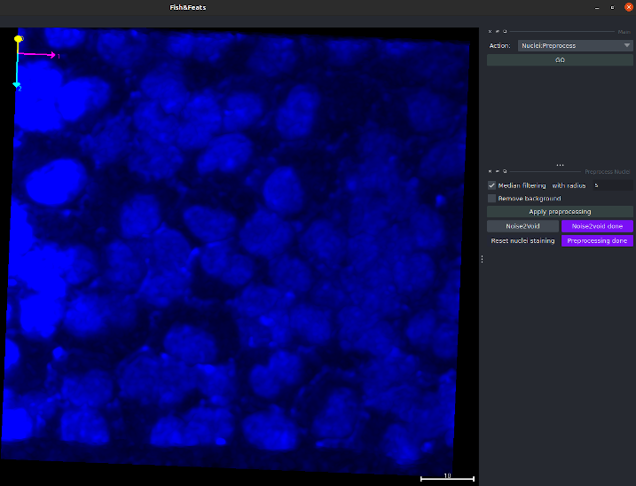

!!! abstract "Preprocess the nuclei channel for better segmentation"
	_To preprocess the nuclei staining image, choose the option `Nuclei:Preprocess` in the main pipeline interface._

You can either apply filters to ameliorate the image, or use noise2void, a deep learning method that reduces the noise in images.

## Filtering

Fishfeats proposes several classic filters to improve the image quality for the segmentation task.
In some cases, this can help the segmentation process.

**Median filter**: If you have a lot of small noises dots, you can apply a median filter, that will smooth locally the image and get rid of small bright or dark dots.
Try to take a filter radius below the average size of a nuclei.
The filter is much slower for higher radii. 
Select the option `Median filtering` and click on `Apply preprocessing`.

**Remove background**: if you have an heterogeneous background in the image (eg a darker corner) and that it seems to impair the performance of the segmentation algorithm (it's not always the case if local normalization is applied), you can remove the background to have more homogeneous local intensities, and a background always close to 0. 
Select the option `Remove background` and click on `Apply preprocessing`.

If you are happy with the filtering, click on `Preprocessing done` to use this new version in the segmentation process. Otherwise, click on `Reset nuclei staining` to test other parameters.

## Noise2Void

Denoising with noise2void needs the Napari plugin `napari-n2v` that you can install in the virtual environment: `pip install napari-n2v` or through the Napari plugin interface.

Click the button `Noise2Void` to open the napari noise2void plugin interface. It will open an interface to perform denoising with a trained noise2void model.

If you don't have a trained noise2void model, you have to train one through the noise2void plugin, externally of FishFeats. 
Noise2void doesn't need annotated data to train, so you will only have to load your image in it and use the options to train it. 
