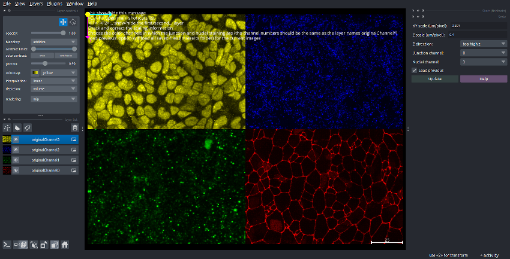
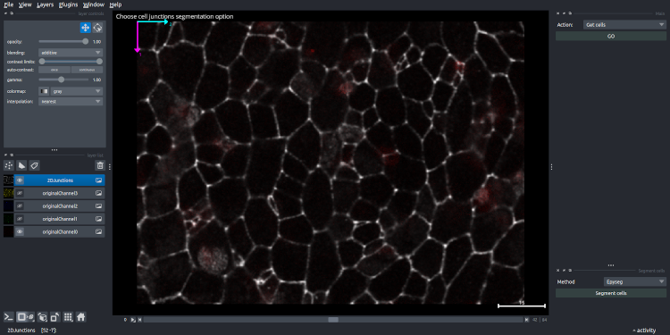
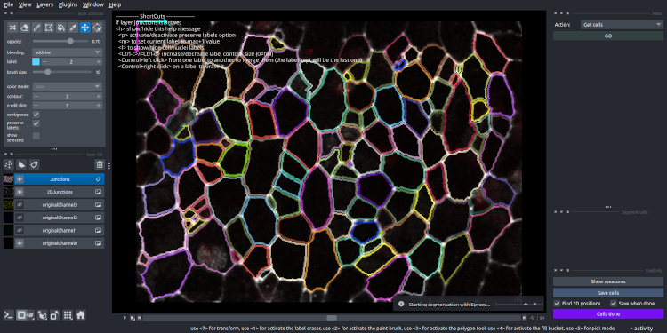
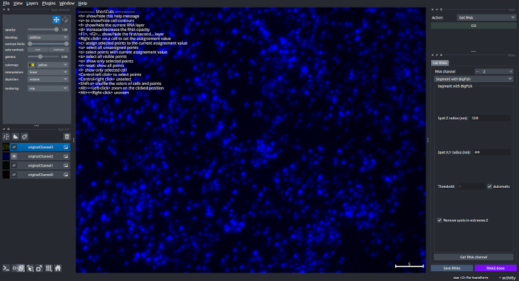
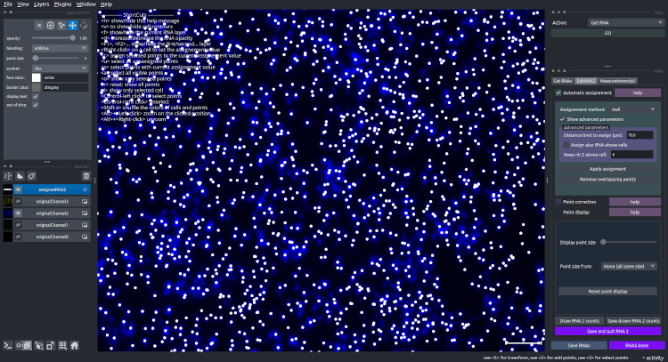
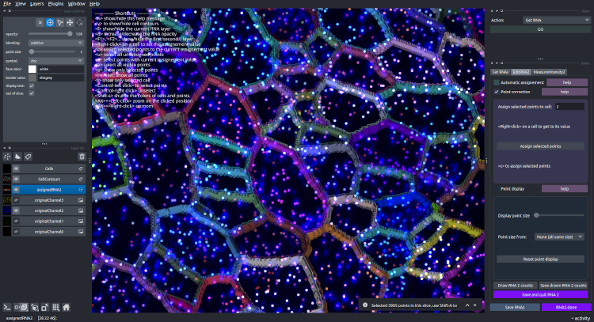
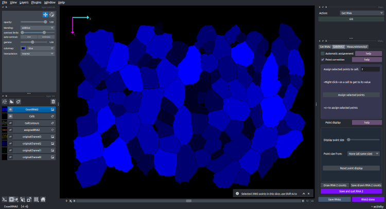

# Step-by-step example 

Here, we propose step-by-step examples of possible usage of the pipeline.
You can download test data from the zenodo repository to follow it.

All the examples here are done with the image `AB3-HG-AQUCISITION-4CHANNELS-SHRNActrl-filtered_minicrop.ims`.

## Count the number of smFish spots by cell

### 1 - Open the image and check/set the metadata

Open `Napari` and start FishFeats with `Plugins>FISHFEATS>Start fishfeats`.

A window dialog appears to select the image to analyse. 
Browse your folders and select the downloaded image `AB3-HG-AQUCISITION-4CHANNELS-SHRNActrl-filtered_minicrop.ims` (or another one on which you want to do this test).

The image is loaded and is displayed with its color channels side by side. 
At the right of the interface, you can set the metadata of the image.

Check that the scaling metadata were correctly loaded and correct them if needed (see image below).

Then, check that the 3D direcion of the image is correct (the higher Z slices correspond to the apical cells = `top high z`).

Set the channels number that contains the junction staining (Zo1) and/or the nuclei staining (DAPI, PCNA, Sox2). 
In our example image, the first channel contains the junction (Zo1), which correspond to number `0 (originalChannel0`), in red.
The nuclei channel is the last channel, `originalChannel3`.

Finally click on `Update` to set these properties for the image. 
All this set-up will be saved in the configuration file `AB3-HG-AQUCISITION-4CHANNELS-SHRNActrl-filtered_minicrop.cfg` associated with this image.
When you reload this image in FishFeats, it will read this configuration file and load it back. 
This file can also be useful if you don't remember which option and parameters you selected for a given step. 
You can open this file and you will see the list of steps and parameter values used.

You can then choose which steps to perform depending of your analysis by selecting the step in the `Main` panel in the right side of the window.

### 2 - Segment epithelia cells

To segment the apical contour of the cells, choose `Get cells` option.

If you have already done this step, the plugin will write `Found projection file` and/or `Found cell file` if it found the corresponding files with the default names. 
You can then choose the option `Load preivous files` to directly load them and go to the manual curation step.

Else, select `do projection and segmentation`.

An interface opens to perform the projection.
You can either load a file of the projected junction staining if ou have done it with another external software (e.g. CARE, LocalZProjector), by clicking on `choose file`. 

Otherwise, click on `Project now` to calculates the local projection with FishFeats.
The projected results will be overlaid in white in your window (image below).
If you are not satified with the results, you can click on `Advanced` to change the parameters and `Project now` again.

Then click on `Projection done` to perform the segmentation on the projected channel.

Choose `Epyseg` in the `Method` interface to perform cell apical segmentation (or CellPose).
If you haven't installed `Epyseg` (not mandatory), you will get an error message. 
Install it in your virtual environement by typing `pip install epyseg`.

Click on `segment cells` and wait for the segmentation to be calculated (0.105 min on this test image with 1 GPU).

You can manually correct the segmentation with shortcuts that are indicated at the top left of your window.

Click on `Cells done` to finish this step and save the results.
Wait while the program save the data and replace the projected cells in 3D.
This can take a little time as it is looking for the best Z-position for each cell.

You have now segmented all the apical cell contours and estimated their position in 3D.
If you open the result file (`AB3-HG-AQUCISITION-4CHANNELS-SHRNActrl-filtered_minicrop_results.csv`) in a table editor (e.g. Excel, R, Prism..) you can already analyse these data (number of cell, apical area, position).
This file will be enriched with all new information that you will add by performing other steps.

### 3 - Segment the smFish staining

Select `Get RNA` in the `Main` interface for this step.

The interface that opens allow you to choose the channel to segment, and the parameter for the segmentation.
Choose `2` in `RNA channel` parameter.

You can now segment this channel with big-fish (if it is not installed (not mandatory), install it with `pip install big-fish`).
Choose the approximate size of one dots in XY, and in Z (not the same as because of imaging technique a circular spot is usually a rugby-balloon shape). 
Put `1200` nm for `Spot Z radius` and `400` nm for `Spot X,Y radius`.
Select `Automatic` for the threshold parameter, to let big-fish select the intensity threshold automatically.
If the automatic threshold does not good result, you can then unclick it and the value determined by big-fish will be written in the parameter box.
You can then modify it.

Click on `Get RNA channel` to perform the segmentation with the selected parameters.

Wait for the segmentation to be calculated (0.103 min on the test image).

When it is finished, a new layer is added to the view, called `assignedRNA2`. 
The center of each RNA spot is displayed as a Napari point in white.
Two new panels have been added to the right side interface of the `RNAs` option. 
You can change the points size with the interface in the right side, as well as colored them by specific properties, in the `Point display` part in `EditRNA2` panel.

### 4 - Assign the segmented dots to their cell, count them

`Automatic assignement` options allow to perform an automatic assignement of each spot to its most likely cell.
We will do assignement with the simplest method, which is the `Projection`.
Each spot will be assigned to the apical cell that it belongs to after an orthoogonal Z-projection.

Select `Projection` in `Assignement method` and click on `Apply assignement`.

When the calculation is finished (0.004 min on our test image), the points are displayed with their assigned cell color. 
The contour of the cell are also overlaid to see directly the correspondance.

You can correct this assignments with the available shortcuts (see text in the top-left part of the window) and with the `Point correction` panel.

You can save the results while you are performing the correction by clicking on `Save RNAs` and click on `Save and quit RNA 2` when all is done.

In the results table, you will now have a new column with the counts of RNA 2 in each cell.
You can also display directly these counts by clicking on `Draw RNA 2 counts` in the `EditRNA2` panel.

You obtain the map of the cells, where each cell is colored by its number of RNA2 spots assigned to it by Projection, then manually corrected.

