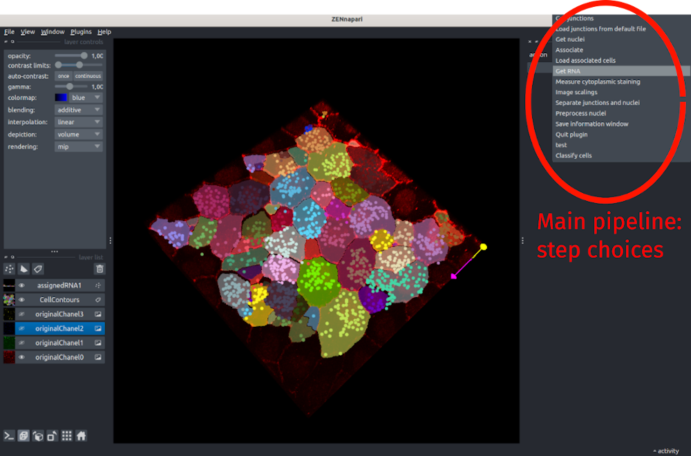

# Fish&Feats 

## Installation

FishFeats is distributed as a pip module and can be installed normally in a virtual environment with: 
``` pip install fishfeats ```

See more details in the [installation](./Installation.md) page, especially if you are not familiar with installing a pip module.

## Usage
You can launch `fishfeats` in napari by going to `Plugins>fishfeats>Start`. It will open a file dialog box asking you to select the image that you want to analyze. Possible input formats are currently `.tif, .czi, .ims`. For other formats, you can first open the image within napari and then start FishFeats by selecting `Plugins>fishfeats>Start from layer(s)`. See [here](Open-image.md) for more information.

Then the image will be displayed, with the different channels shown as separated layers on the left panel.


### Outputs/Setup
All the outputs of `fishfeats` will be saved in the folder called `results` that will be automatically created in the folder containing your image. If you run `fishfeats` again on the same image, the program will look into that folder for already saved files, so that you can load previous files and don't have to redo all the steps from scratch.

At each step, the parameters that you used for your current image are saved in the associated configuration file (in the `results` folder, the file `yourimagename.cfg`) and will be reloaded each time you redo the same step.

From version 1.2 of FishFeats, for all steps, measures are saved in the same file in the `results` folder, called `yourimagename_results.csv`. You can open this file out of the pipeline with any software for tabular data reading/analysis (Excel, R..) and analyse/extract the desired columns. 


### Main features

`fishfeats` proposes several analyses steps in the main interface:

- [Image scalings](Image-scalings.md): set the global parameter of the image to analyse (scalings, channels)
- [Segment cells](Get-cells.md): segment/load/correct the cell apical contours in 2D
- [Segment nuclei](Get-nuclei.md): segment/load/correct the nuclei in 3D.
- [Separate junctions and nuclei](Separate-junctions-and-nuclei.md): if the junctions staining and nuclei staining are in the same channel, to segment them it is necessary to separate them before with this step.
- [Segment and assign RNAs](Get-RNAs.md): segment/assign/correct/measure the RNAs in one or more RNA channel.
- [Classify cells](Classify-cells.md): manually classify the segmented cells with a user defined criteria (eg "PCNA or not"). Can be automatically prefilled then manually corrected.
- [Measure cytoplasmic staining](Measure-cytoplasmic-staining.md) to measure the intensity of one or more channels in each segmented cell around the surface.
- [Measure nuclear staining](Measure-nuclear-staining.md) to measure the intensity of one or more channels in each segmented nucleus.
- [Measure RNA staining](Get-RNAs.md#measure-intensity) to measure the intensity of one or more channels in each segmented RNA.



When you open a new image, the plugin will directly go to the first mandatory steps of fixing the image scales and channels (image scalings).
To guide you through the steps, we propose typical pipelines that can be followed with flowcharts [here](./FishFeatsFlowchartv5.pdf#page=1).
Fish&Feats allows flexibility in its usage, so that it can be used for different image analysis tasks, so we don't enforce any order for the proposed action, but a few depends on other being done before. Please refer to the flowchart to see the dependencies.

Finally, to allow for more flexibility, it is possible to go back and forth between steps. 
For example, after segmenting the cells, if you work on classifying the cells and spot an error in the segmentation that you missed previously, you can go back to the segmentation correction and back again to the classification afterwards without having to restart it from scratch.
Just save regurlarly your data to be able to reload it.

The parameters that you enter in the interface for each step are saved in a configuration file (.cfg) so that when you reload an image, all parameters will be set to the last value used.

### General shortcuts

For each step, **FishFeats** proposes shortcuts to make its use more agreable/user-friendly, aditionnaly to the ones already proposed by Napari. The specific shortcuts are indicated in the text overlay showed at the top left side of the view. 

**You can always press <kbd>h</kbd> to show/hide these help messages**.

A few other shortcuts are always available:

???+ tip "Shortcuts"
	
	|   |     |	
	| ---------- | ------------------------------------ |
	| **Napari default shortcuts** | go to `File>Preferences>Shortcuts` to see the list of available shortcuts, associated with each kind of layers |
	| <kbd>h</kbd>| show/hide help message|
	| <kbd>Ctrl-v</kbd> | Activate/desactive vispy visualisation mode in 3D. This mode allows you to control the visualisation angle, but can inactive some selection tools.|
	| <kbd>F1</kbd> | Show/hide the first layer (from the list of layers in the left bottom part of the window, starting from the bottom). By default, the first layer should be your input image first color chanel, called `originalImageChanel0` in FishFeats.|
	| <kbd>F2</kbd> | Show/hide the second layer, <kbd>F3</kbd> for the third layer...|


### Pipeline: steps overview

To guide users through the steps, we propose typical pipelines that can be followed with flowcharts [here](./FishFeatsFlowchartv5.pdf#page=1)

### Hierarchical clustering

You can launch this analysis with `Plugins>fishfeats>Hierarchical clustering`.
It will perform hierarchical clustering on a set of columns (that contains RNA counts for example) and show the resulting clustering on the segmented cells. 
See [Hierarchical clustering](Hierarchical-clustering.md) for more infos.

## Issues
A list of encountered errors and their solution is given [here](Known-errors-and-solutions.md)
